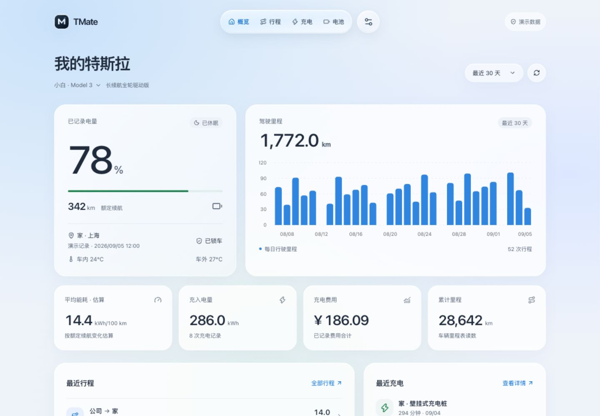
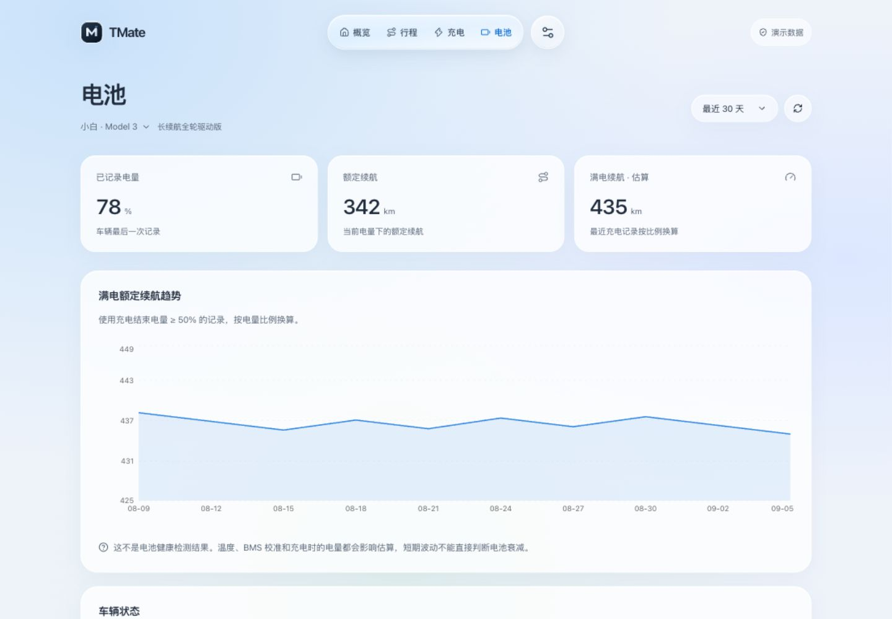
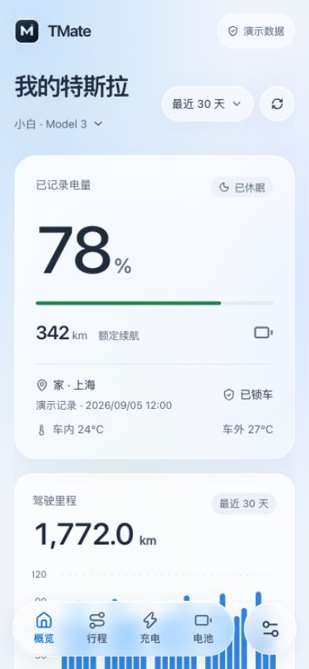
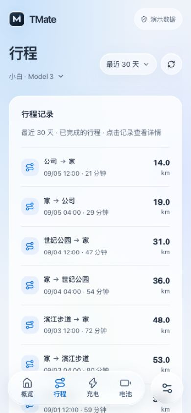
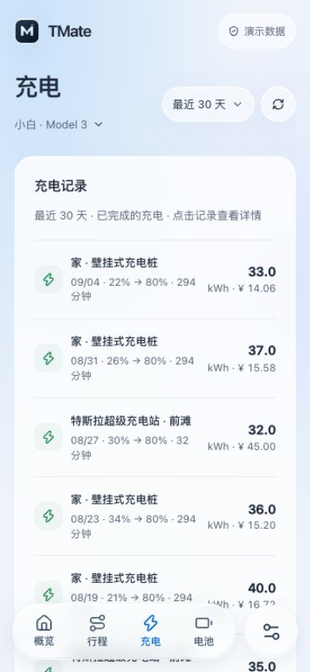
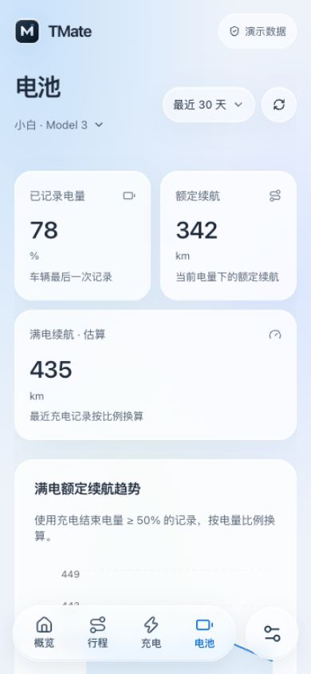

# TMate


你的 TeslaMate，随手可看。一个手机优先的独立只读客户端，同一套界面支持网页、Android 和 iOS。

**前置依赖：[TeslaMate](https://github.com/teslamate-org/teslamate)。** TMate 不采集 Tesla 账户数据，不替代 TeslaMate，也不要求删除 Grafana。请先让 TeslaMate 正常采集，再连接它的 PostgreSQL；MQTT 为可选增强。

## 功能

- 电量、续航、里程、温度、车辆位置和四轮胎压；缺少 MQTT 时回退到数据库记录，并标明采样时间。
- 行程、充电、能耗、费用和电池续航趋势，支持多车辆和 7 / 30 / 90 天统计。
- 设置电费单价，补算缺失的充电费用；已记录金额保持不变。车辆软件版本回退升级历史，哨兵显示 MQTT 最近已知状态与来源。
- 高德中文道路底图、行程轨迹、起终点缩放和包含道路的中文地址；没有门牌时不编造门牌。
- 简洁的玻璃风格界面、固定底部导航、触摸滑动切换和减少动态效果支持。
- HTTPS、只读访问密钥、网页一次性配对和 30 天设备会话。
- 独立的原生部署 / Docker 配置、systemd 示例与 TeslaMate 新安装脚本。

TMate 不提供车辆控制，不主动唤醒车辆，不读取 TeslaMate 登录令牌表。高德 Key 仅在服务端使用；未填写时可以查看车辆历史，但没有高德底图与详细中文地址。

## 界面预览

以下为 TMate 1.1.0 的实际网页截图，全部使用内置演示数据，不包含真实车辆、行程或账户信息。H5 为手机尺寸的浏览器视口截图，不代表原生 App 真机截图。

### PC · 桌面端

概览：电量、续航、里程、能耗与充电费用。



电池：记录电量、额定续航与满电续航估算趋势。



### H5 · 手机网页

点击图片可查看原图。底部固定玻璃导航支持触摸滑动切换。

| 概览 | 行程 |
| --- | --- |
| [](docs/screenshots/h5-overview.jpg) | [](docs/screenshots/h5-drives.jpg) |

| 充电 | 电池 |
| --- | --- |
| [](docs/screenshots/h5-charges.jpg) | [](docs/screenshots/h5-battery.jpg) |

## 从这里开始

| 你的情况 | 下一步 |
| --- | --- |
| 已经部署 TeslaMate | [创建只读账号并接入](docs/deployment.md#3-接入已有-teslamate) |
| 还没有 TeslaMate | [一键安装前置项目](docs/deployment.md#2-全新安装-teslamate可选) |
| 使用 Docker / 飞牛 / 群晖 / Linux NAS | [Docker 部署 TMate](docs/deployment.md#4-docker-部署-tmate) |
| 不使用 Docker | [Node.js 原生部署](docs/deployment.md#5-原生部署-tmate) |
| 域名、证书或只能开放高端口 | [HTTPS 与非 443 端口](docs/deployment.md#6-https域名与非-443-端口) |
| 打包自己的手机 App | [Android / iOS 打包](docs/mobile.md) |
| GitHub Actions 自动打包与镜像发布 | [自动构建教程](docs/github-actions.md) |
| 更新、备份或排错 | [维护与排错](docs/deployment.md#8-维护备份与排错) |

完整部署教程包含前置条件、配置字段、两种安装方式、开机启动、证书、授权、验证、更新、备份和卸载边界。可下载源码包，或克隆本项目：

```bash
git clone https://github.com/skysliences/TMate.git
cd TMate
```

镜像发布状态以 [Actions](https://github.com/skysliences/TMate/actions) 和自己的 Docker Hub 仓库为准；源码不预设不存在的公共镜像地址。

## 配置文件：全部由你填写

```bash
cp .env.example .env
chmod 600 .env
# 生成随机值后，自己复制到相应字段；不要复用相同密钥
openssl rand -hex 32
```

| 文件 | 内容 | 是否进入网页 / App |
| --- | --- | --- |
| [.env.example](.env.example) → `.env` | TMate 的数据库只读连接串、API_KEY、高德 Key、MQTT 与服务地址 | 否 |
| [deploy/teslamate/.env.example](deploy/teslamate/.env.example) → 同目录 `.env` | TeslaMate 加密密钥、管理员数据库密码、Grafana 密码和端口 | 否 |
| [.env.admin.example](.env.admin.example) → `.env.admin` | 仅原生数据库初始化使用的管理员连接信息 | 否，不能交给 TMate 进程 |
| [mobile.config.json](mobile.config.json) | 可选的默认服务地址、安卓单个局域网 HTTP 例外 | 是，**禁止填写密钥** |

`API_KEY` 是你为 TMate 创建的随机访问密钥，不是 Tesla Token、高德 Key 或 NAS 密码。高德 `AMAP_KEY` 使用 **Web 服务**类型，不是 JavaScript SDK 类型。不要把任何真实配置、证书私钥、位置缓存或安卓签名文件上传 GitHub。

## TeslaMate 一键安装

需要 Docker Engine/Desktop、Compose v2 和 Python 3.9+。**已有 TeslaMate 的用户跳过此步骤。**

```bash
cp deploy/teslamate/.env.example deploy/teslamate/.env
chmod 600 deploy/teslamate/.env
# 编辑文件，填入你自己的三个不同随机密钥及服务器地址
bash scripts/install-teslamate.sh --check
bash scripts/install-teslamate.sh
```

脚本只拉取官方固定版本镜像，创建独立 TeslaMate / PostgreSQL / Grafana / Mosquitto 栈。不会自动安装系统软件、获取 Tesla 登录信息、覆盖已有角色、修改已有采集栈或删除数据卷。未填配置会停止，检测到已有部署会拒绝执行。`--dry-run` 可预览操作范围。首次仍需在 TeslaMate 页面按[官方授权指南](https://docs.teslamate.org/docs/installation/tokens/)填写 Token。

## 开发与验证

需要 Node.js 22.13+（建议 22.x LTS）和 npm：

```bash
npm ci
npm run dev
npm run typecheck
npm run lint
npm test
python3 -m unittest discover -s scripts -p '*_test.py'
npm run build:web
```

`build:web` 输出 `www/`，用于自托管网页与 App；`npm run build` 保留现有 Sites 网页构建。服务以 `npm run api` 读取本地 `.env` 启动；不要把开发服务器直接暴露公网。

```text
app/、mobile/         网页入口
components/、lib/     共享界面与客户端
server/              只读 PostgreSQL / MQTT / 高德接口
public/              TMate SVG 图标
deploy/              Docker、Nginx、systemd 和配置示例
scripts/             配置校验、前置安装、只读角色和打包工具
docs/                完整部署、移动端与数据口径文档
android/、ios/       Capacitor 原生工程
```

新版本保留 `dev.bugo.voltlog` 包标识、旧设备偏好键和内部 `voltlog` 协议标识，以兼容旧 App；这些不是显示名称。原有飞牛安装请保留其 Compose 项目名、只读账户与配置，**不要用全新安装教程覆盖生产目录**。新增发布包不包含个人飞牛部署记录或私密配置。

## 安全与边界

- 适合个人或家庭自用；一枚访问密钥可读取该数据库所有车辆，不是多租户账号系统。
- 公网与手机 App 使用 HTTPS。HTTP 仅用于可信局域网/本机，数据库和 MQTT 不应暴露公网。
- 网页同源配对使用 HttpOnly / SameSite=Strict Cookie，HTTPS 下增加 Secure。远程网页和 App 的访问密钥仅在内存中保留。
- 高德会收到地址解析所需端点及底图中心；不接收整段轨迹。位置缓存保存在自己的服务器，不能公开分享。
- [数据口径、接口与限制](docs/data-and-api.md)。界面测试与构建通过不等于已经在所有 NAS、手机或系统版本上实际安装验证。

## 致谢

特别感谢 **[TeslaMate](https://github.com/teslamate-org/teslamate)** 项目、最初作者 Adrian Kumpf、维护者和所有贡献者。TeslaMate 提供了车辆数据采集、持久化和 MQTT 发布能力，是 TMate 的前置依赖与数据基础。欢迎给上游项目 Star，并支持它的持续维护。

TMate 是独立第三方客户端，**不是 Tesla、TeslaMate 或高德的官方应用，也未获得这些项目的官方背书**。新 Logo 是深色底上的银色 M 标记，不使用 Tesla 或 TeslaMate 的官方标识。一键脚本基于[官方 Docker 安装说明](https://docs.teslamate.org/docs/installation/docker/)，只部署官方镜像，不嵌入或修改 TeslaMate 服务源码。上游许可与商标说明请查阅 [TeslaMate LICENSE](https://github.com/teslamate-org/teslamate/blob/main/LICENSE) 和 [TRADEMARK](https://github.com/teslamate-org/teslamate/blob/main/TRADEMARK.md)。

也感谢 [Capacitor](https://capacitorjs.com/)、[React](https://react.dev/)、[Recharts](https://recharts.org/) 等开源项目。
